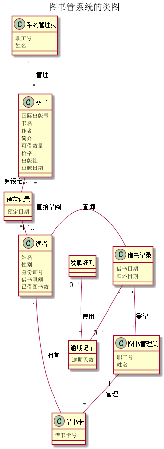
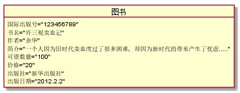
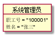
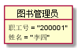
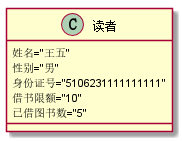
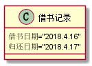
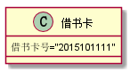

# 实验三：图书管理系统领域对象建模
<table>
<tr>
<td>学号</td>
<td>班级</td>
<td>姓名</td>
<td>照片</td>
</tr>
<tr>
<td>201510414324</td>
<td>2015级软件工程三班</td>
<td>余行</td>
<td></td>
</tr>
</table>

## 1 图书管理系统类图
### 1.1 类图PlantUML源代码:
    @startuml
    title 图书管系统的类图

    Class 图书{
    国际出版号
    书名
    作者
    简介
    可借数量
    价格
    出版社
    出版日期
    }

    Class 预定记录{
    预定日期
    }
    hide 预定记录 Circle

    Class 借书记录{
    借书日期
    归还日期
    }

    Class 读者{
    姓名
    性别
    身份证号
    借书限额
    已借图书数
    }

    Class 图书管理员{
    职工号
    姓名
     }
    Class 系统管理员{
    职工号
    姓名
    }
    Class 借书卡{
    借书卡号
    }
    Class 逾期记录{
    逾期天数
    }
    hide 逾期记录 Circle

    Class 罚款细则
    hide 罚款细则 Circle

    图书 "1" - "*" 预定记录:被预定
    预定记录 "*" - "1" 读者
    读者 - 借书记录:查询
    借书记录 "*" -- "1" 图书管理员:登记
    借书记录 "*" -- "0..1" 逾期记录
    罚款细则 "0..1" -- "*" 逾期记录:使用
    系统管理员 "1.." -- "*" 图书:管理
    读者 "1" -- "1" 借书卡:拥有
    图书管理员 "1.." -- "*" 借书卡:管理
    读者 "1.." -- "*" 图书:直接借阅
    @enduml

### 1.2 类图如下：

### 1.3 类图说明：
上图由系统管理员，图书，预定记录，读者，借书记录，图书管理员，借书卡。逾期记录等类组成，其中，系统管理员可以对图书进行增加删除修改，读者可以通过直接借书和间接借书，其中，间接借书就是预定图书，借书后生成的借书记录由管理员管理，管理员可对不按时还书的人实行罚款处理，其中，每位读者都有一张借书卡，读者可通过此卡借书。

## 2 图书管理系统的各个对象图及源码
### 2.1 图书类的对象：
#### 源码：
    @startuml
    object 图书{
    国际出版号="123456789"
    书名="许三观卖血记"
    作者="余华"
    简介="一个人因为旧时代卖血度过了很多困难，却因为新时代的带来产生了忧虑....."
    可借数量="100"
    价格="20"
    出版社="新华出版社"
    出版日期="2012.2.2"
    }

    @enduml

#### 对象图：

### 2.2 系统管理员类的对象:
#### 源码：
    @startuml
    Object 系统管理员{
    职工号 = "100001"
    姓名 = "张三"
    }
    @enduml

#### 对象图：

### 2.3 图书管理员类的对象:
#### 源码：
    @startuml
    Object 图书管理员{
    职工号 = "200001"
    姓名 = "李四"
    }
    @enduml

#### 对象图：

### 2.4 读者类的对象:
#### 源码：
    @startuml
    Class 读者{
    姓名="王五"
    性别="男"
    身份证号="5106231111111111"
    借书限额="10"
    已借图书数="5"
    }
    @enduml

#### 对象图：

### 2.5 借书记录类的对象:
#### 源码：
    @startuml
    Class 借书记录{
    借书日期="2018.4.16"
    归还日期="2018.4.17"
    }
    @enduml

#### 对象图：

### 2.6 借书卡类的对象:
#### 源码：
    @startuml
    Class 借书卡{
    借书卡号="2015101111"
    }
    @enduml

#### 对象图：
