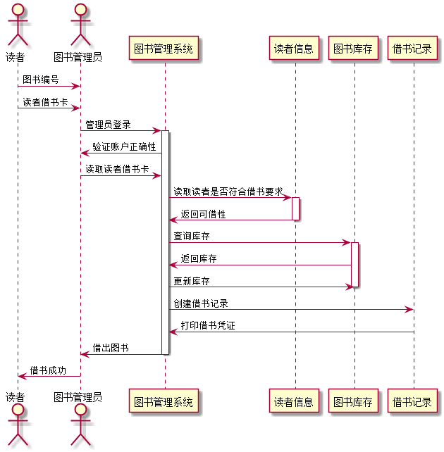
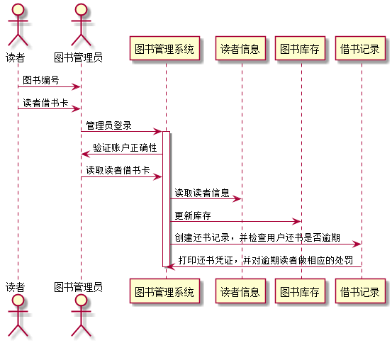
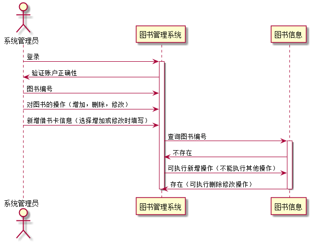
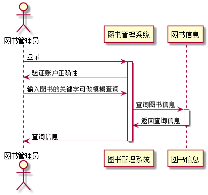
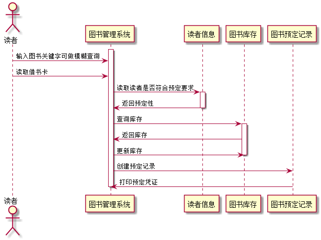
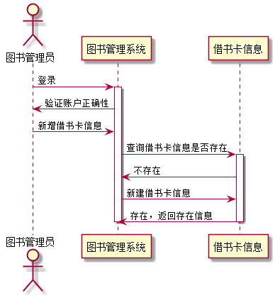

# 实验四：图书管理系统顺序图绘制
<table>
<tr>
<td>学号</td>
<td>班级</td>
<td>姓名</td>
<td>照片</td>
</tr>
<tr>
<td>201510414324</td>
<td>2015级软件工程三班</td>
<td>余行</td>
<td></td>
</tr>
</table>

## 1 借书用例
### 1.1 借书用例PlantUML源码：
    @startuml
    actor 读者
    actor 图书管理员
    participant "图书管理系统" as A
    participant "读者信息" as B
    participant "图书库存" as C
    participant "借书记录" as D

    读者->图书管理员 :图书编号
    读者->图书管理员 :读者借书卡
    图书管理员 -> A: 管理员登录
    activate A
    A->图书管理员:验证账户正确性
    图书管理员 -> A: 读取读者借书卡
    A -> B: 读取读者是否符合借书要求
    activate B
    B -> A: 返回可借性
    deactivate B
    A -> C: 查询库存
    activate C
    C-> A: 返回库存
    A -> C: 更新库存
    deactivate C
    A -> D: 创建借书记录
    D -> A:打印借书凭证
    deactivate D
    A -> 图书管理员: 借出图书
    deactivate A
    图书管理员->读者:借书成功

    @enduml

### 1.2 借书用例顺序图：

### 1.3 借书用例顺序图说明：
读者通过图书编号和借书卡向图书管理员借书，图书管理员登陆成功后查看用户是否符合借书要求，图书库存是否符合借书要求，符合借书要求就把书借给读者，系统做出相应操作：更新图书库存并记录打印相应的凭证

## 2 还书用例
### 2.1 还书用例PlantUML源码：
    @startuml
    actor 读者
    actor 图书管理员
    participant "图书管理系统" as A
    participant "读者信息" as B
    participant "图书库存" as C
    participant "借书记录" as D

    读者->图书管理员 :图书编号
    读者->图书管理员 :读者借书卡
    图书管理员 -> A: 管理员登录
    activate A
    A->图书管理员:验证账户正确性
    图书管理员 -> A: 读取读者借书卡
    A -> B: 读取读者信息
    A -> C: 更新库存
    deactivate C
    A -> D: 创建还书记录，并检查用户还书是否逾期
    D -> A:打印还书凭证，并对逾期读者做相应的处罚
    deactivate D
    deactivate A

    @enduml

### 2.2 还书用例顺序图：

### 2.3 还书用例顺序图说明：
读者通过图书编号和借书卡和书籍给图书管理员，图书管理员登陆成功后，系统读取读者相应信息，并更新图书库存，并查看图书时候逾期，逾期可对读者做出相应的处罚

## 3 系统管理员对图书新增删除更新用例
### 3.1 用例PlantUML源码：
    @startuml
    actor 系统管理员
    participant "图书管理系统" as A
    participant "图书信息" as C
    系统管理员 -> A: 登录
     activate A
    A->系统管理员:验证账户正确性
    系统管理员 -> A: 图书编号
    系统管理员 -> A: 对图书的操作（增加，删除，修改）
    系统管理员 -> A: 新增借书卡信息（选择增加或修改时填写）
    A -> C: 查询图书编号
    activate C
     C-> A: 不存在
    A ->C:可执行新增操作（不能执行其他操作）
     C-> A: 存在（可执行删除修改操作）
    deactivate C
    deactivate A

    @enduml

### 3.2 用例顺序图：

### 3.3 用例顺序图说明：
系统管理员登陆成功后可以输入图书编号对图书进行相应的操作，当选择新增或者修改时必须填写相应的图书信息，选择删除时便可只输入书籍的编号

## 4 图书查询用例
### 4.1 用例PlantUML源码：
    @startuml
    actor 图书管理员
    participant "图书管理系统" as A
    participant "图书信息" as C
    图书管理员 -> A: 登录
    activate A
    A->图书管理员:验证账户正确性
     图书管理员 -> A: 输入图书的关键字可做模糊查询
    A -> C: 查询图书信息
    activate C
    C-> A: 返回查询信息
     deactivate C
    A -> 图书管理员: 查询信息
    deactivate A

    @enduml

### 4.2 用例顺序图：

### 4.3 用例顺序图说明：
当系统管理员需要查询书籍时，可以进行书籍查询，该查询支持模糊查询，将查询关键字进行匹配返回查询信息给查询者

## 5 图书预定用例
### 5.1 用例PlantUML源码：
    @startuml

    actor 读者
    participant "图书管理系统" as A
    participant "读者信息" as B
    participant "图书库存" as C
    participant "图书预定记录" as D

    activate A
    读者 -> A:输入图书关键字可做模糊查询
    读者 -> A:读取借书卡
    A -> B: 读取读者是否符合预定要求
    activate B
    B -> A: 返回预定性
    deactivate B
    A -> C: 查询库存
    activate C
    C-> A: 返回库存
    A -> C: 更新库存
    deactivate C
    A -> D: 创建预定记录
    D -> A:打印预定凭证
    deactivate D
    deactivate A

    @enduml

### 5.2 用例顺序图：

### 5.3 用例顺序图说明：
读者可以在图书管理系统通过模糊查询到自己想要的书籍，并将借书卡放在机器上，系统读取借书卡信息看是否符合预定条件，看图书库存是否符合预定条件，若符合预定条件，系统更新图书库存，记录并打印图书预定凭证

## 6 借书卡办理用例
### 6.1 用例PlantUML源码：
    @startuml
    actor 图书管理员
    participant "图书管理系统" as A
    participant "借书卡信息" as C
    图书管理员 -> A: 登录
    activate A
    A->图书管理员:验证账户正确性
    图书管理员 -> A: 新增借书卡信息
    A -> C: 查询借书卡信息是否存在
    activate C
    C-> A: 不存在
    A ->C:新建借书卡信息
    C-> A: 存在，返回存在信息
    deactivate C
    deactivate A

    @enduml

### 6.2 用例顺序图：

### 6.3 用例顺序图说明：
图书管理员登陆图书管理系统，可通过输入借书号查询是否存在该借书卡，若不存在，新建借书卡信息，若存在，返回存在信息，不能再次办理