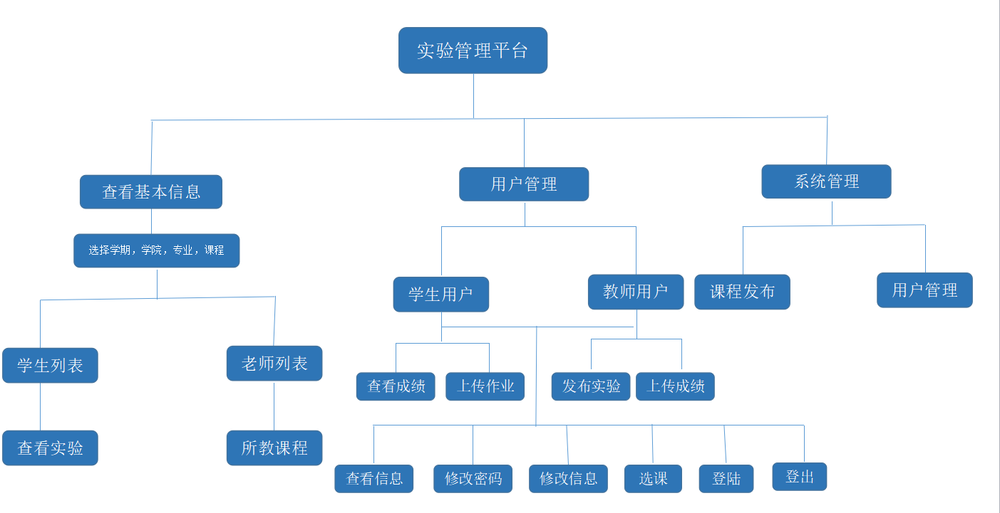
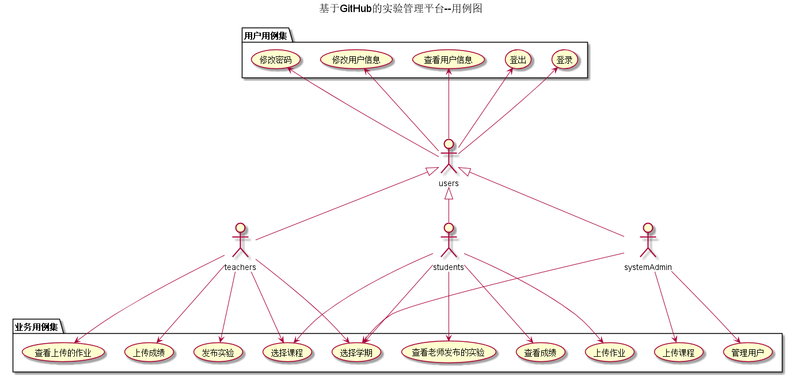
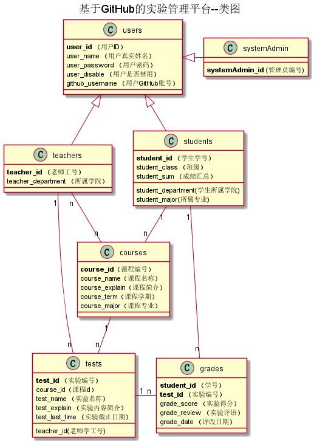

# 实验六：基于GitHub的实验管理平台的分析与设计
<table>
<tr>
<td>学号</td>
<td>班级</td>
<td>姓名</td>
<td>照片</td>
</tr>
<tr>
<td>201510414324</td>
<td>2015级软件工程三班</td>
<td>余行</td>
<td></td>
</tr>
</table>

## 1.概述
* 基于GitHub的实验管理平台的作用是在线管理实验成绩的Web应用系统。学生和老师的实验内容均存放在GitHUB 页面上。
* 学生的功能主要有：一是设置自己的GitHub用户名，二是查询自己的实验成绩。学生的GitHub用户名是公开的，但成绩不公开。
* 老师的功能主要有：一是批改每个学生的成绩，二是查看每个学生的成绩。
* 老师和学生都能通过本系统的链接方便地跳转到学生的每个GitHUB实验目录，以便批改实验或者查看实验情况。
* 实验成绩按数字分数计算，每项实验的满分为100分，最低为0分。
* 系统自动计算每个学生的所有实验的平均分
* 如果是推广全国高校，涉及了一些高校管理与学校的选择，数据库数量呈指数上升，因此推广高校也是用的该系统，只是将老师信息与学生信息修改
即可，课程不需修改，因为课程是通过管理员添加的，所以各高校可以通过自己的实际情况添加课程

## 2.系统总体结构

[界面设计](https://yuhang456.github.io/is_analysis/test6/ui/index.html)

## 3.用例图设计 [源码](src/caseTotal.puml)

## 4.类图设计 [源码](src/classTotal.puml)

## 5.数据库设计
- ### [参见数据库设计](数据库设计.md)

## 6.用例及界面详细设计
- ### [登录用例](user/登陆用例.md),[界面](https://yuhang456.github.io/is_analysis/test6/ui/index.html)
- ### [登出用例](user/登出用例.md),[界面](https://yuhang456.github.io/is_analysis/test6/ui/index.html)
- ### [查看用户信息用例](user/查看用户信息用例.md),[界面](https://yuhang456.github.io/is_analysis/test6/ui/userinfor.html)
- ### [修改用户密码用例](user/修改用户密码用例.md),[界面](https://yuhang456.github.io/is_analysis/test6/ui/repassword.html)
- ### [修改用户信息用例](user/修改用户信息用例.md),[界面](https://yuhang456.github.io/is_analysis/test6/ui/reuserInfor.html)
- ### [老师选课用例](user/老师选课用例.md),[界面](https://yuhang456.github.io/is_analysis/test6/ui/teacherchoose.html)
- ### [学生选课用例](user/学生选课用例.md),[界面](https://yuhang456.github.io/is_analysis/test6/ui/studentchoose.html)
- ### [发布实验用例](user/发布实验用例.md),[界面](https://yuhang456.github.io/is_analysis/test6/ui/fbtest.html)
- ### [上传课程用例](user/上传课程用例.md),[界面](https://yuhang456.github.io/is_analysis/test6/ui/shangchuankecheng.html)
- ### [上传实验分数用例](user/上传实验分数用例.md),[界面](https://yuhang456.github.io/is_analysis/test6/ui/reviewgrade.html)
- ### [查看成绩用例](user/查看成绩用例.md),[界面](https://yuhang456.github.io/is_analysis/test6/ui/watchgrade.html)