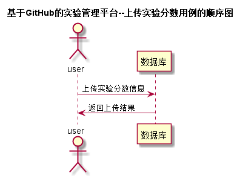

# 上传实验分数用例 [返回](../README.md)
## 1. 用例规约

|用例名称|评定成绩|
|-------|:-------------|
|功能|老师查看学生实验然后上传分数，可以对学生的实验做出评价|
|参与者|老师|
|前置条件|教师用户登录|
|后置条件| 提交成绩后，系统自动计算平均成绩|
|主流事件| 评定成绩|
|备注| |

## 2. 业务流程 [源码](../src/上传实验分数.puml)
 

## 3. 界面设计
- 界面参照 : [上传实验分数界面](https://yuhang456.github.io/is_analysis/test6/ui/reviewgrade.html)

- API接口调用
    - 接口1：[reviewGrade](../impl/上传实验分数接口.md)

## 4. 算法描述
    无

## 5. 参照表

- [STUDENTS](../数据库设计.md/#STUDENTS)
- [GRADES](../数据库设计.md/#GRADES)
- [TESTS](../数据库设计.md/#TESTS