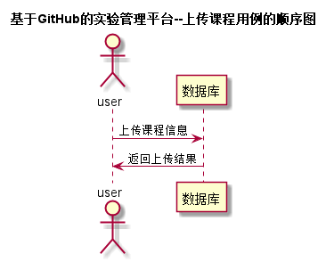

# 上传课程用例 [返回](../README.md)

## 1. 用例规约

|用例名称|登录|
|-------|:-------------|
|功能|上传课程信息|
|参与者|管理员|
|前置条件| 管理员登录|
|后置条件|添加课程成功|
|主流事件| 上传每个学年学院专业的课程信息|
|备注| |

## 2. 业务流程 [源码](../src/上传课程.puml)
 

## 3. 界面设计
- 界面参照 : [查看成绩界面](../ui/shangchuankecheng.html)
- API接口调用
    - 接口1：[addCource](../impl/上传课程接口.md)

## 4. 算法描述
无

## 5. 参照表
- [COURSES](../数据库设计.md/#COURSES)