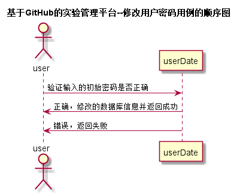
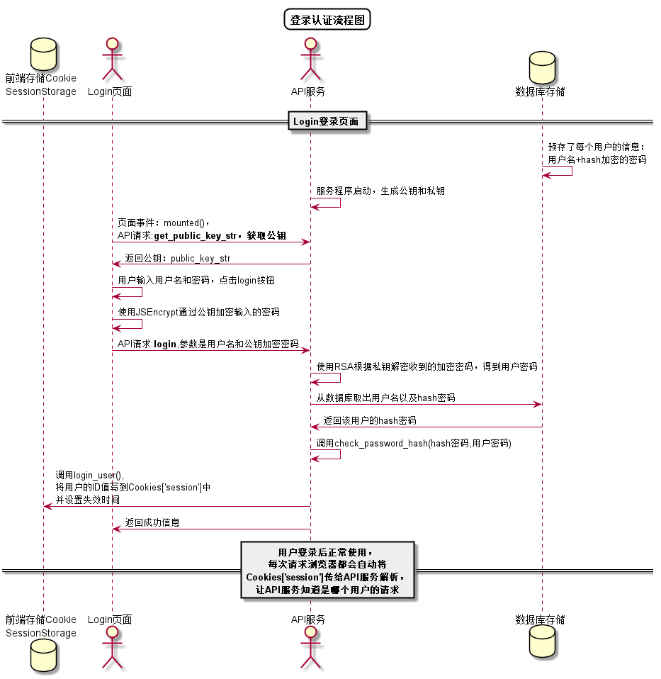

# 修改用户密码用例 [返回](../README.md)
## 1. 用例规约

|用例名称|修改用户密码|
|-------|:-------------|
|功能|修改用户的密码|
|参与者|学生/老师/管理员|
|前置条件|必须先登录|
|后置条件|修改密码以后必须强制登出，再跳转到登录页面|
|主流事件| |
|备注| |

## 2. 业务流程 [源码](../src/修改用户密码.puml)
 

## 3. 界面设计
- 界面参照 : [查看成绩界面](../ui/rePassword.html)
- API接口调用
    - 接口1：[login](../impl/修改用户密码接口.md)

## 4. 算法描述 [源码](../src/用户登录认证流程.puml)

## 5. 参照表
users
- [USERS](../数据库设计.md/#USERS)