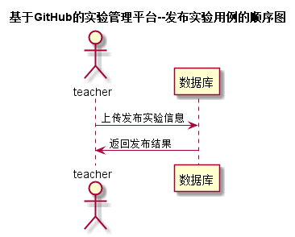

# 发布实验用例 [返回](../README.md)
## 1. 用例规约

|用例名称|发布实验|
|-------|:-------------|
|功能|老师发布课程的实验|
|参与者|老师|
|前置条件|必须先登录|
|后置条件| |
|主事件流| |
|备选事件流| |

## 2. 业务流程 [源码](../src/发布实验.puml)
 

## 3. 界面设计
- 界面参照 : [发布实验界面](https://yuhang456.github.io/is_analysis/test6/ui/fbtest.html)
- API接口调用
    - 接口1：[addTest](../impl/发布实验接口.md)

## 4. 算法描述
无

## 5. 参照表
- [TESTS](../数据库设计.md/TESTS)