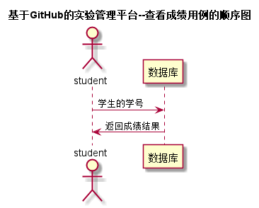

# 查看成绩用例 [返回](../README.md)

## 1. 用例规约

|用例名称|学生查看成绩|
|-------|:-------------|
|功能|学生可以查看自己的成绩|
|参与者|学生|
|前置条件|学生账号登陆|
|后置条件||
|主事件流| 学生查看成绩|
|备选事件流| |

## 2. 业务流程 [源码](../src/查看成绩.puml)
 

## 3. 界面设计
- 界面参照 : [查看成绩界面](../ui/watchgrade.html)
- API接口调用
    - 接口1：[watchGrade](../impl/查看成绩接口.md)

## 4. 算法描述
- 无

## 5. 参照表

- [STUDENTS](../数据库设计.md/#STUDENTS)
- [GRADES](../数据库设计.md/#GRADES)
- [TESTS](../数据库设计.md/#TESTS)