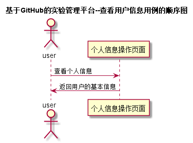

# 查看用户信息用例 [返回](../README.md)
## 1. 用例规约

|用例名称|查看用户信息|
|-------|:-------------|
|功能|查看用户的所有信息|
|参与者|学生/老师|
|前置条件|必须先登录|
|后置条件| |
|主流事件| |
|备注| |

## 2. 业务流程 [源码](../src/查看用户信息.puml)
 

## 3. 界面设计
- 界面参照 : [查看成绩界面](../ui/watchinfor.html)
- API接口调用
    - 接口1：[getUserInfo](../impl/查看用户信息接口.md)

## 4. 算法描述
无

## 5. 参照表
- [STUDENTS](../数据库设计.md/#STUDENTS)
- [USERS](../数据库设计.md/#USERS)