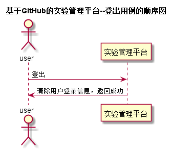

# 登出用例 [返回](../README.md)

## 1. 用例规约

|用例名称|登出|
|-------|:-------------|
|功能|已经登录的用户登出实验管理平台|
|参与者|学生/老师/管理员|
|前置条件| |
|后置条件|登出后，跳转到登录页面|
|主流事件| |
|备注| |

## 2. 业务流程 [源码](../src/登出.puml)
 

## 3. 界面设计
- 界面参照 : [登出界面](https://yuhang456.github.io/is_analysis/test6/ui/index.html)
- API接口调用
    - 接口1：[logout](../impl/登出接口.md)

## 4. 算法描述
 无
## 5. 参照表

- [USERS](../数据库设计.md/#USERS)